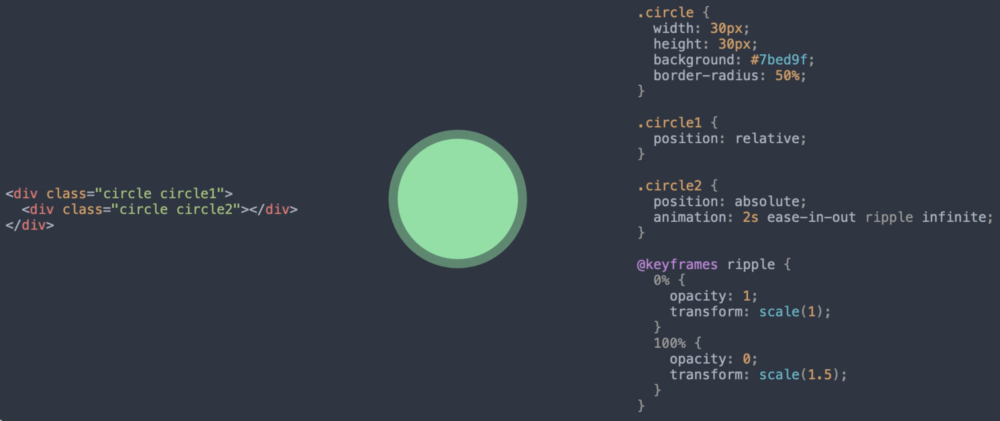

# CSS 技巧

## 样式调整

元素的宽高、字体的颜色大小间距、背景颜色或图片等等

```css
p {
  width: 200px;
  height: 50px;
  color: #ff4757;
  font-size: 24px;
  letter-spacing: 2px;
  background-color: #f1f2f6; 
}
```

有些属性可以一次性设置多个项目

- background-color 背景颜色
- background-image 背景图片
- background-origin 定位区域
- background-position 起始位置
- ...

可以查阅 [MDN](https://developer.mozilla.org/en-US/docs/Web/CSS) 之类的文档网站学习它们的用法。


## 布局调整

CSS 的一大难题就在于对页面进行整体布局，需要把思维放到一个整体上来对布局进行规划，然后合理利用 CSS 的 Flex 和 Grid 来实现。多数情况下的页面并不是规规矩矩的布局，经常会有层叠偏移等奇特的布局方式，所以 CSS 有脱离文档流这个概念。

> 文档流概念可参考视频 [2 分钟掌握网页文档流](https://www.bilibili.com/video/BV1q3411u7wr/)


使用 absolute 绝对定位或 fixed 固定定位，又或者是使用 float 属性都会导致元素脱离正常的文档流。

```css
div {
  position: absolute;
}
div {
  position: fixed;
}
div {
  float: left;
}
```

正常的文档流是说元素都是从上到下、从左到右依次排列的快捷元素。因为占据一整行，所以都是从上到下排列，而元素脱离文档流之后，这个元素就相当于被拿走，后边的元素会占用这个元素的空间，以此类推。而这个单独被拿走的元素，则可以通过像 left、top 之类的属性，根据一定的规则来自由移动。如果有重叠，则可以通过 z-index 来控制谁在上谁在下。

```css
div {
  position: absolute;
  left: 20px;
  top: 20px;
  z-index: -1;
}
```

需要注意的是使用 transform 属性调整元素的位置，不会导致它们脱离文档流，它们所占的空间会停留在原位。

```css
div {
  transform: translateX(20px) translateY(20px);
}
```


响应式布局用 CSS 实现比较简单，通过 media 查询屏幕宽度，根据页面的显示效果把相应的样式覆盖让页面显示正常

```css
@media(max-width: 1024px) {
  /* ... */
}
```

要训练对布局的规划，可以参考一些网站，从简单规整的开始逐步分析它们的布局，例如导航头部区域，内容分区和底部信息


自己用简单的 HTML 元素方块把它规划出来，忽略组件细节。

慢慢的再去看一些不规则布局的网站，再用自己的方法把它实现出来。

慢慢的就会形成一种思路，看到设计稿就能知道怎么大体规划网站的布局了。

> 响应式布局设计可参考视频 [如何实现响应式网页设计](https://www.bilibili.com/video/BV1UW4y1b7L9/)
>
> flexbox 布局模型可以参考视频 [2分钟掌握 CSS flexbox 布局](https://www.bilibili.com/video/BV1P7411m7Nu/)
>
> grid 布局模型可以参考视频 [【迄今为止最易懂】2分钟掌握 CSS Grid 布局](https://www.bilibili.com/video/BV18p411A7JB/)


## 形状、特效的拆解与合并

为什么说前端工程师要学一点点设计方面的知识，因为前端页面实现中会有不规则的图形、动画效果等等。而在设计师的眼中，复杂的图形都是由最基本的形状来构成的，所谓的点线面。

比如 CSS 画一个三角形出来可以利用border 边框

一个普通的 div 元素，有四条边，其实每条边衔接的地方都是被切掉的一角，那么可以通过把 div 的宽度和高度取消，然后通过调整边框的宽度来制作出一个三角形


又比如说一个波纹动画，可以把它拆解成两个同样的元素叠在一起，底下的元素先放大，然后把透明度最终过渡成零，就有了这样的效果




想理解前端页面和组件的特效，先去研究一下设计的基本原则和理论，不但能加快开发效率，而且能减少与设计师沟通的成本和时间。


## 页面组件设计原则

在写代码之前，需要先认真研究一下设计稿，分析哪些页面上的组件完全或者大体相同，那么可以把这些组件的样式通过 class 或者其他方式做成一个独立的整体，再通过组合多个 class 来扩展原有的样式，比如说一个按钮可能有不同的颜色，不同的大小，但是形状和文字大小间距都是一样的话，可以通过一个 button class 来定义按钮的通用样式，然后利用 color class 来控制它的颜色。


另外如果你发现在大多数情况下都在写重复的 CSS 代码，那么这些代码就很可能用于多个组件，这种情况下本着不编写重复代码的精神，把它单独抽离出来作为工具 Class utility。


这样其他使用相同 CSS 属性的元素就可以直接使用它，比如说使用 flex 布局时，可以定义一个 `.flex` class 用于开启 flex，然后定义一个 `.column` class 用于按列排布，还可以定义 `.center`、`.left` 等 class，控制 flex 子元素的对齐方式


在设计组件时，首先分析设计稿中哪些组件大体相同，然后把它们的公共样式抽离出来，有特殊情况时通过组合 class 来覆盖已有的样式，另外在设计组件时，只关心组件盒子内部的区域，不要设置像外边距这样的属性，它们应该由包含这个组件的容器来设置。因为相同的组件在不同容器中的位置和间距可能不同。


## CSS 模块化学习

要学好 CSS 可以把它分解成独立的模块，整体上 CSS 可以做的操作有

- 通过选择器选择对应的 HTML 元素，应用样式
- 设置元素外观，比如颜色、背景、字体等
- 调整元素的位置与其他元素的间距
- 安排一组元素或者整个页面的布局
- 覆盖或继承已有样式

把这些功能分好类，逐一突破，就不至于感觉 CSS 像大杂烩一样


学习 CSS 建议看的就是 [MDN](https://developer.mozilla.org/en-US/docs/Web/CSS) 和 [w3schools](https://www.w3schools.com/)，随时查阅属性的含义，如果想看具体的特效或者图形是怎么实现的，可以谷歌搜索或者浏览 [codepen](https://codepen.io/) 寻找灵感。


# 参考资料

[现代 CSS 进化史](https://zhuanlan.zhihu.com/p/33769659)

[只要一行代码，实现五种 CSS 经典布局](https://www.ruanyifeng.com/blog/2020/08/five-css-layouts-in-one-line.html)